# WinTAK-plugintemplate
Plugin Template for WinTAK > 4.9.

## Introduction
WinTAK SDK for CIV exist since [4.1.0.231](https://www.civtak.org/2020/09/23/wintak-is-publicly-available/). However, it is only since the WIinTAK SDK 4.9 that some changes were made. These changes include the fact that a part of the content of the SDK includes NuGet Packages to develop and build wpk (eXtension name for WinTAK plugin).

## Prerequisites
* Download from [tak.gov](https://tak.gov/products/wintak-civ) the corresponding WinTAK SDK.
<div align=center>
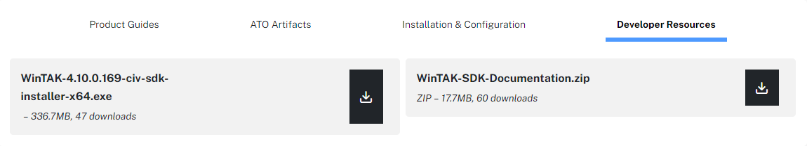
</div>

* Microsfot Visual Studio (for this plugintemplate : Visual Studio 2022 v17.7.3 works)

* .NET Framework which correspond to the Nugget Package .NET Framerwork version. In case of, here is a [link](https://dotnet.microsoft.com/en-us/download/dotnet/6.0) for older version.

## Extending WinTAK
This section is based on the WinTak-SDK-documentation which can be found on tak.gov. The html file is : *md_doxygen_extending_wintak__extending_win_tak.html*

### Overview
WinTAK offers the ability to extend the application using buttons on the ribbon bar and new dockable windows. WinTAK utilizes the Managed Extensibility Framework [MEF](https://learn.microsoft.com/en-us/dotnet/framework/mef/) to add functionality. MEF follows a *“convention over configuration”* model. This document will walk you through adding a new dockable window and two buttons to WinTAK.

### Getting Started
#### Creating the project
Open Visual Studio and select File -> New -> Project… In the New Project dialog, search for **WPF User Control Library** template. Depending on version you can also identify it with *(.NET Framework)*.

<div align=center>
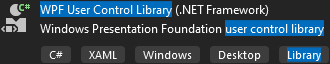
</div>

Give a name to your project

<div align=center>
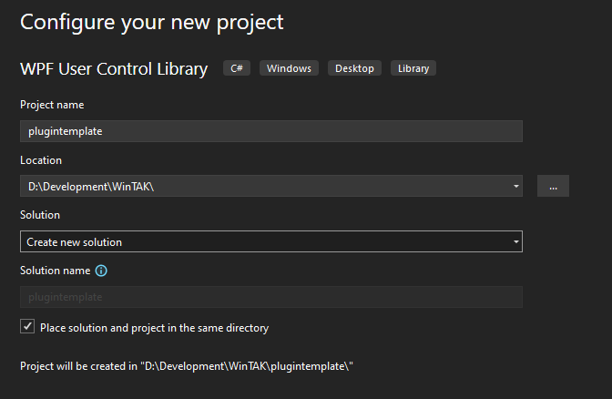
</div>

And Finaly select the .NET Framework to use 

**!! Use the version .NET Framework 4.8.1 !!**

<div align=center>
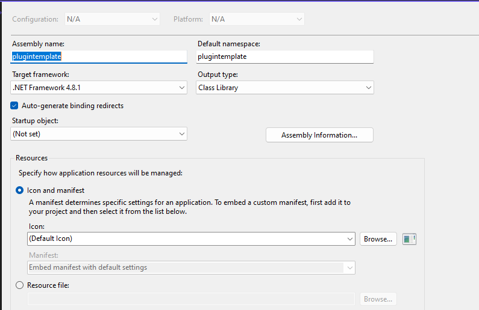
</div>

Click on **create**.

The project will come with one *WPF UserControl* class. This class will be the view of your dockable window.

#### Project Dependencies
The necessary WinTAK dependencies are available on the SDK installation folder. By default : C:\Program\WinTAK\NuGet.

To setup local NuGet packages in Visual Studio go to Tools > NuGet Package Manager > Manage NuGet Packages for Solution...

<div align=center>
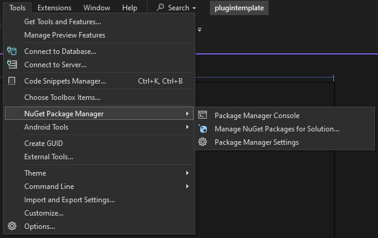
</div>

Click on the wheel which is on the right side of Package source: nuget.org. It will open a Options Menu and locate you in *NuGet Package Manager > Package Sources*. Click on the **+** and go to your WinTAK NuGet folder. Close the Options Menu.

<div align=center>
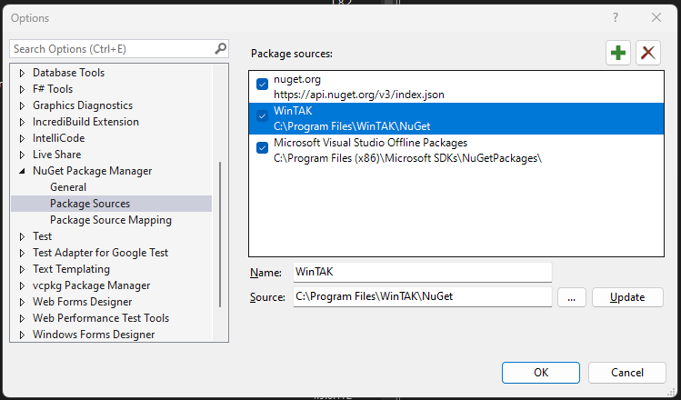
</div>


Go to **Browse** and in Package source: menu, select WinTAK (which is the name provided in the Package sources menu). You will see all NuGet package for WinTAK. Select **WinTak-Dependencies** package and install the version you wish to build your plugin against.

The installation of WinTak-Dependencies will install other NuGet Package : 
* Angle-Dist
* libLAS
* Prism.Core
* TAK.Kernel
* TTP-Dist


<div align=center>
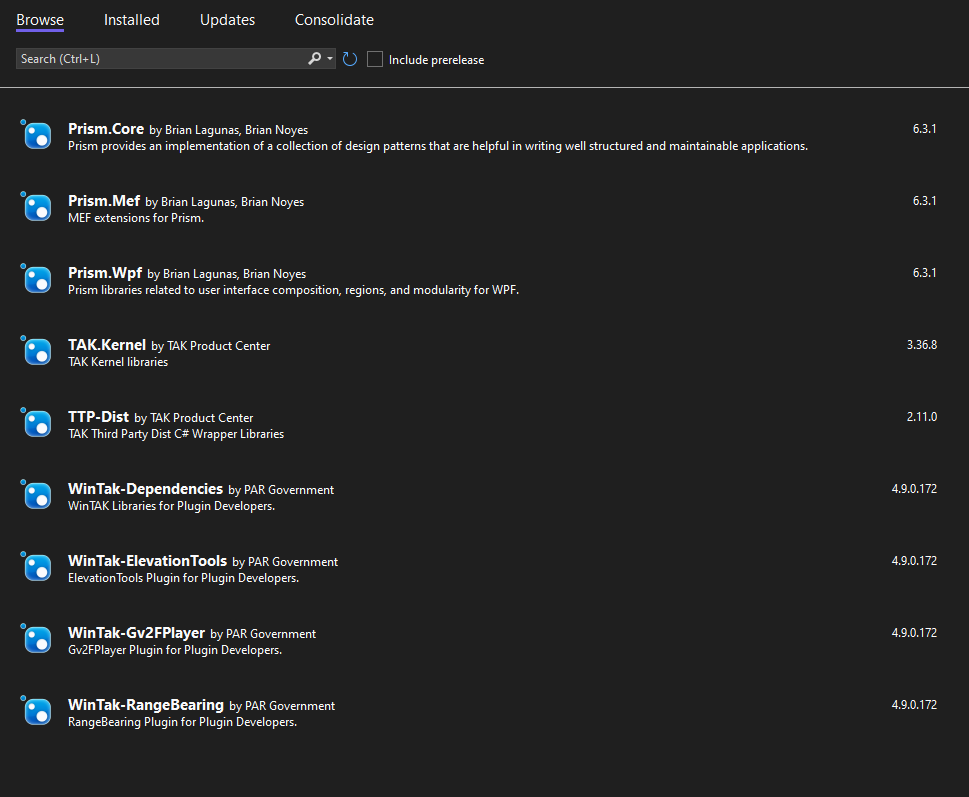
</div>

In addition to the WinTAK Dependencies, you will need to add one other reference. Right click in the Solution Explorer and select Add -> Reference ... You'll need to add a reference to System.ComponentModel.Composition. You can find System.ComponentModel.Composition in the Assemblies node.

<div align=center>
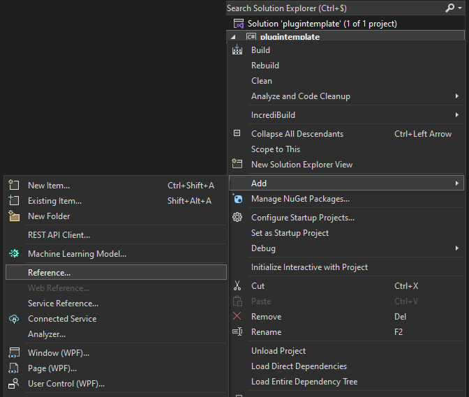 <br><br>
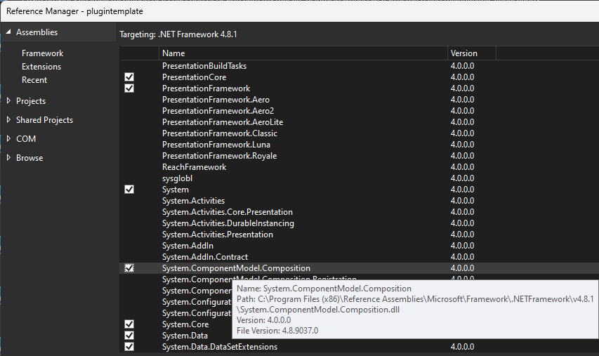
</div>

### Creating the Dockable Window
The dockable window will be the view that is displayed whenever your window is shown.

#### Creating the view
In your project there should be a file named **UserControl1.xaml**. rename this to **TemplateView.xaml** and then double click on it to open the view. The view will be empty with only a *Grid* control within it. We will add one *Button* control and a *TextBlock* to the view.

Add the following XAML to the view inside the *Grid* element.

```xml
<StackPanel>
    <Button Content="Increase counter "
            Command="{Binding IncreaseCounterCommand}" />
    <TextBlock Text="{Binding Counter}" />
</StackPanel>
```
**!!! Ensure that the TemplateView.xaml.cs is also modified :**

```csharp
namespace plugintemplate
{
    /// <summary>
    /// Interaction logic for TemplateView.xaml
    /// </summary>
    public partial class TemplateView : UserControl
    {
        public TemplateView()
        {
            InitializeComponent();
        }
    }
}
``` 

#### Creating the DockPane
The **DockPane** (as referenced in WinTAK-Documentation class_win_tak_1_1_framework_1_1_docking_1_1_dock_pane.html) class provides the ability to Hide/Show your dockable window and serves as the *ViewModel* for your view. Right click to the project in the Solution Explorer and select Add -> New Item. Select Class and name it as TemplateDockPane.cs. Click on **Add**.

<div align=center>
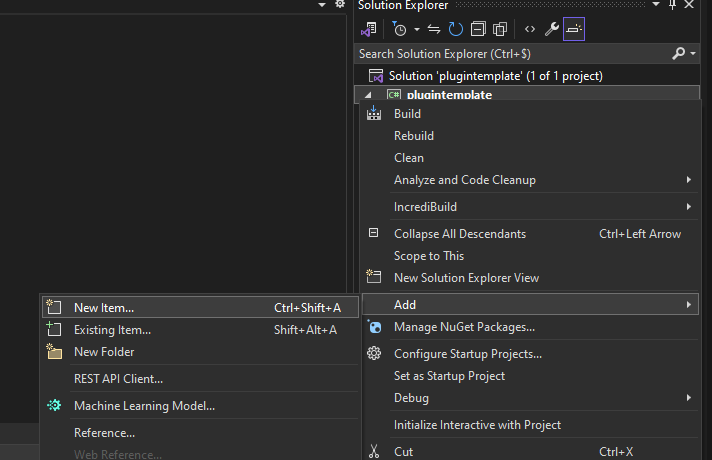 <br><br>
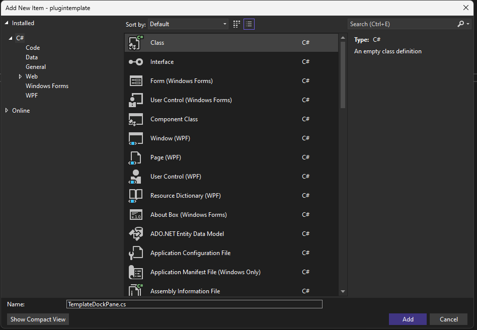
</div>

Add the following using statements to the class
```csharp
using System.ComponentModel.Composition;
using System.Windows.Input;
using WinTak.Framework.Docking;
using WinTak.Framework.Docking.Attributes;
```
The TemplateDockPane class should inherit from the DockPane class.

```csharp
internal class TemplateDockPane : DockPane
{
}
```
The TemplateDockPane class will hold a Counter property that will increase every time the button in the view is clicked. To increase the counter another IncreaseCounterCommand property is used that the button binds to. Add the following code to your TemplateDockPane class.

```csharp
class TemplateDockPane : DockPane
{
    private int _counter;
 
    public TemplateDockPane()
    {
        var command = new ExecutedCommand();
        command.Executed += OnCommandExecuted;
        IncreaseCounterCommand = command;
    }
 
    public ICommand IncreaseCounterCommand { get; private set; }
    public int Counter
    {
        get { return _counter; }
        set { SetProperty(ref _counter, value); }
    }
 
    private void OnCommandExecuted(object sender, EventArgs e)
    {
        Counter++;
    }
 
    private class ExecutedCommand : ICommand
    {
        public event EventHandler CanExecuteChanged;
 
        public event EventHandler Executed;
 
        public bool CanExecute(object parameter)
        {
            return true;
        }
 
        public void Execute(object parameter)
        {
            var handler = Executed;
            if (handler != null)
            {
                handler(this, EventArgs.Empty);
            }
        }
    }
}
```

#### Attribues
Attributes are what MEF looks for when loading assemblies. When a class has the ExportAttribute assigned to it, MEF will add the class to the container of all classes it knows about.

Add the following attribute to the class (after namespace plugintemplate):
```csharp
[DockPane(ID, "Template", Content = typeof(TemplateView))]
```
And the following constant to the class (after internal class TemplateDockPane : DockPane):
```csharp
internal const string ID = "Template_TemplateDockPane";
```
### Create a Button to Open Your Dockable Window
Buttons (as referenced in WinTAK-Documentation class_win_tak_1_1_framework_1_1_tools_1_1_button.html) are placed on the Ribbon panel of WinTAK. Buttons can be used to initiate map interaction, open dockable windows, or anything else that needs activated.
Add a new TemplateButton class to the project. (same steps than adding the TemplateDockPane).

<div align=center>
    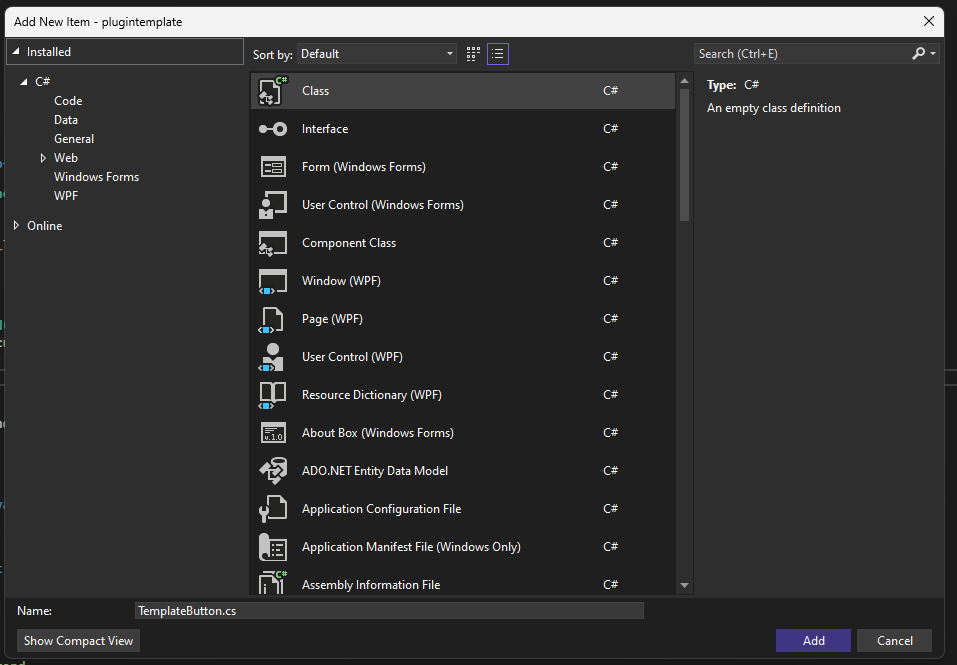
</div>

Add the following using statements to the class
```csharp
using System.ComponentModel.Composition;
using WinTak.Framework.Docking;
using WinTak.Framework.Tools;
using WinTak.Framework.Tools.Attributes;
```

The TemplateButton class should inherit from the Button class.

```csharp
class TemplateButton : Button
{
}
```
#### Attributes
Like the DockPane, buttons are registered with MEF using class attributes. The following attributes will be used with the button.

```csharp
[Button("Template_TemplateButton", "Template Plugin",
    LargeImage = "pack://application:,,,/plugintemplate;component/assets/Settings.svg",
    SmallImage = "pack://application:,,,/plugintemplate;component/assets/Settings_24x24.png")]
```

The Button registers images that will be used for the Ribbon bar. These images are registered with the LargeImage and SmallImage metadata properties (which is defined in the WinTAK NuGet and in WinTAK-Documentation : *class_win_tak_1_1_framework_1_1_tools_1_1_attributes_1_1_button_attribute.html*). This example uses two images found in the assets folder of the project. The images should have a build action of Resource.

**!! to adding icons in the project, add a Folder and add existing files in it. After that, click on both icons and in the *properties*, Build Action need to be set to Resource**

<div align=center>
    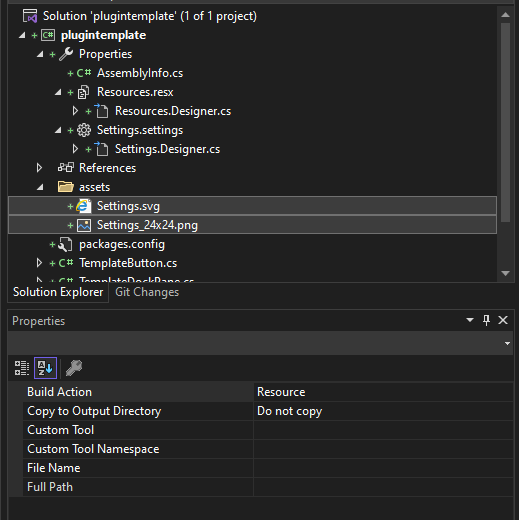
</div>

#### Opening the dockable window
When the button is clicked it will open the dockable window. The window can be opened with the IDockingManager. The button uses MEF to get the single instance of IDockingManager. Using the ImportingConstructor attribute on the constructor, MEF will inject in required dependencies.

```csharp 
private IDockingManager _dockingManager;
 
[ImportingConstructor]
public TemplateButton(IDockingManager dockingManager)
{
    _dockingManager = dockingManager;
}
```
When the button is clicked it will open the DockPane. Override the OnClicked method to open the DockPane.

```csharp
protected override void OnClick()
{
    base.OnClick();
 
    var pane = _dockingManager.GetDockPane(TemplateDockPane.ID);
    if (pane != null)
        pane.Activate();
}
```

### Lazy Loading
WinTAK uses a lazy loading approach with MEF. Buttons and DockPanes will not get created until they are needed. This speeds up startup time of the application. Buttons will be created when they are clicked and DockPanes will be created the first time they are obtained from the IDockingManager.

### Modules
If you have services in your plugin that need to be initialized at startup it's best to start those services from a Module.

Add a new TemplateModule class to your project.

<div align=center>
    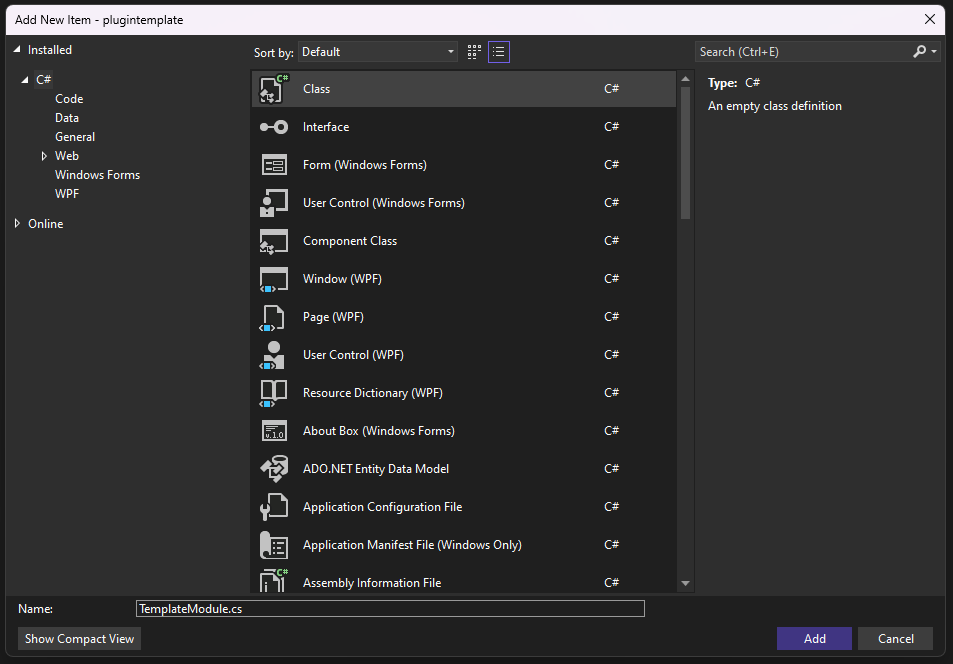
</div>

Add the following using statements to the class

```csharp
using System.ComponentModel.Composition;
using Prism.Events;
using Prism.Mef.Modularity;
using Prism.Modularity;
```
** To ensure you do not have an issue, in the NuGet Package Manager, install the Prism.Mef package which is provided by the WinTAK NuGet package.**

The TemplateModule class should implement the IModule interface and should be decorated with the ModuleExport attribute in order to be recognized by MEF.

```csharp
[ModuleExport(typeof(TemplateModule), InitializationMode = InitializationMode.WhenAvailable)]
class TemplateModule : IModule
{
    private readonly IEventAggregator _eventAggregator;
 
    [ImportingConstructor]
    public TemplateModule(IEventAggregator eventAggregator)
    {
        _eventAggregator = eventAggregator;
    }
 
    // Modules will be initialized during startup. Any work that needs to be done at startup can
    // be initiated from here.
    public void Initialize()
    {
    }
}
```

The IModule interface will require the class to implement an **Initialize** method. This method will be called on startup to notify the module that it has been initialized. This may be a good place to startup services that your plugin depends on or register for events that your module is interested in.

### Adding the project to WinTAK
WinTAK will load plugins from the *appdata%/wintak/plugins/* folder. You can auto copy plugin by adding a post-build setp in the project properties.

#### Copy assembly in post build event
In the project properties, view the Build Events tab and add the following to the post build event.

Go to Project > %projectname% Properties

<div align=center>
    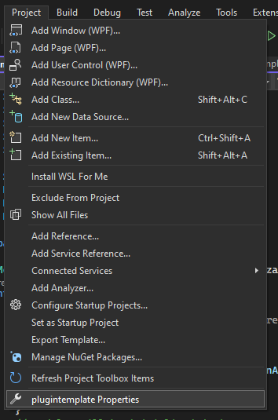
</div>

```bash
xcopy "$(TargetDir)$(TargetName).dll" "%appdata%\wintak\plugins\MyPlugin\" /y
xcopy "$(TargetDir)$(TargetName).pdb" "%appdata%\wintak\plugins\MyPlugin\" /y
```
<div align=center>
    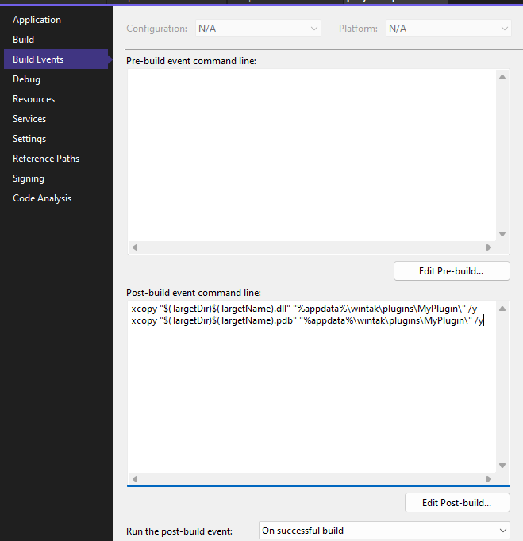
</div>

### Debugging your plugin
#### x64 version check
Before building, ensure that your are on x64 version.

<div align=center>
    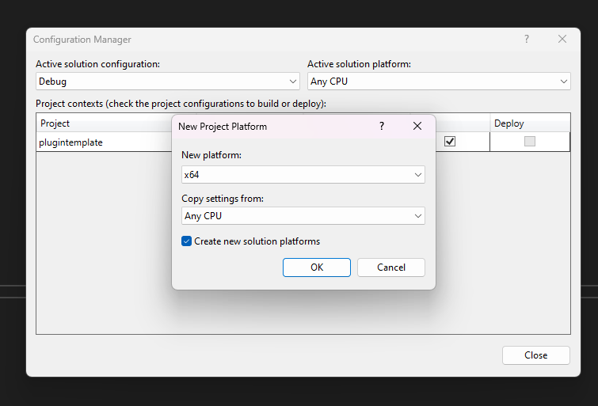
</div>

#### Attach WinTAK
In the project properties view the Debug tab. 
* Set the Start Action to be Start external program and set the location to be WinTAK.exe 
* Under Start Options set the Working directory to be the install location of WiNTAK.

<div align=center>
    
</div>
After that you can build and run the plugintemplate. Normally, the run will open the WinTAK Developer build and after that navigate to the Plugins Ribbon and you will see your Template Plugin as shown here after.

<div align=center>
    
</div>

## General assembly attributes

If you want to build the plugin with all the general info about the assembly attributes already preset,
open the `AssemblyInfo.cs` file and paste your attributes.

e.g at the bottom of `AssemblyInfo.cs`
```csharp
// Version information for an assembly consists of the following four values:
//
//      Major Version
//      Minor Version
//      Build Number
//      Revision
//
// You can specify all the values or you can default the Build and Revision Numbers
// by using the '*' as shown below:
// [assembly: AssemblyVersion("1.0.*")]
[assembly: AssemblyVersion("1.0.0.0")]
[assembly: AssemblyFileVersion("1.0.0.0")]
[assembly: WinTak.Framework.TakSdkVersion("4.10.0.162")]
[assembly: WinTak.Framework.PluginDescription("WinTak Example Plugin Product By Your Name")]
[assembly: WinTak.Framework.PluginIcon(@"C:\Path\To\Plugin\Image\Gear.ico")]
[assembly: WinTak.Framework.PluginName("My Epic Plugin")]
```
## Build for WinTAK release version
In the WinTAK installation folder (by default : C:\Program\WinTAK), an WpkBuilder.exe exist. To be able to build an official WinTAK plugin, you first need to build your plugin in a release version. The release version is located in *%project%\bin\x64\release*.

After that, you can start the WpkBuilder.exe and fill the requested field as shown here after :
* Plugin Package ID : the name of your plugin
* Plugin Description : the description of what your plugin do
* Plugin Icon File : add a custom icon to your plugin (comestic)
* x64 Plugin Directory : Where your plugin build release is

<div align=center>
    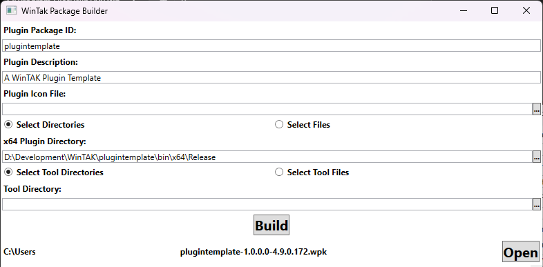
</div>


After that you can build the plugin and a wpk will be generated.

You can double-click on the WPK on the machine where you have a WinTAK in release version and the WPK will automatically install it :

<div align=center>
    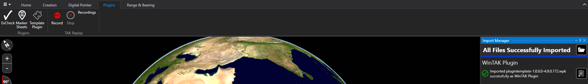
</div>

## Conclusion
That's all for a step-by-step explanation to build a plugin template for WinTAK. If you cannot successfully implement it, feel free to join ATAK Discord Community and reach dev's and I.
